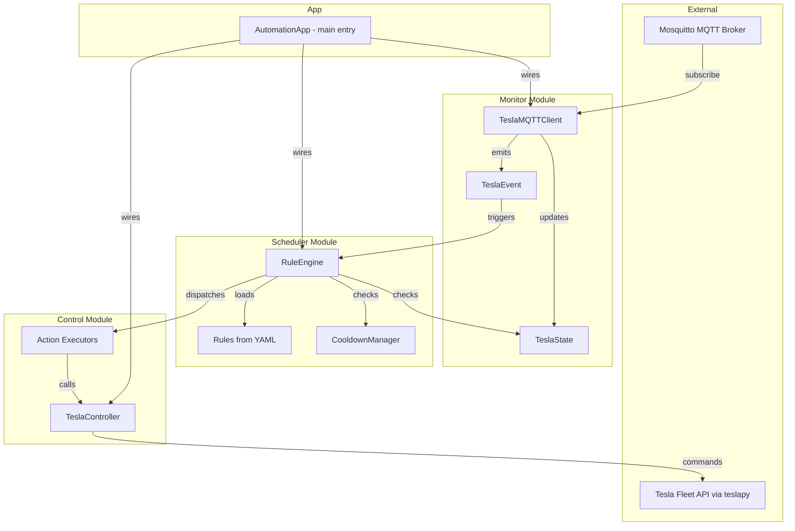
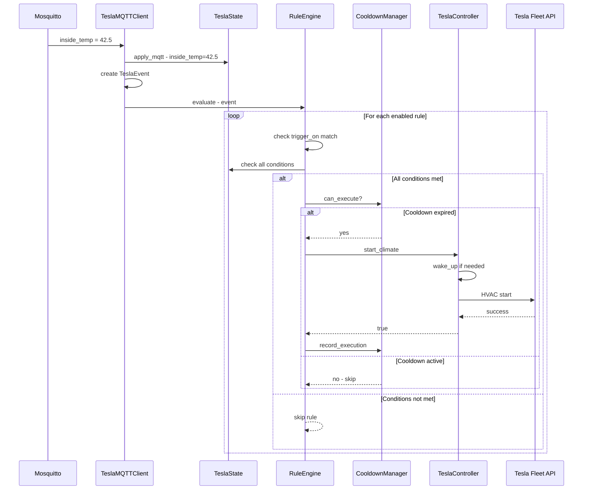

# Tesla Automation System – Architecture Design

## Overview

This document describes the architecture for a 3-module automation system built on top of the existing TeslaMate MQTT infrastructure. The system enables **monitoring** vehicle state, **scheduling** actions based on composite conditions, and **controlling** the vehicle via Tesla Fleet API.

---

## Current Implementation Status

### What Already Exists (Monitor Module – ~80% complete)

| Component | Status | Notes |
|-----------|--------|-------|
| [`TeslaState`](tesla/models/state.py:27) | ✅ Complete | Full vehicle state dataclass with 60+ fields, auto-coercion from MQTT strings |
| [`TeslaEvent`](tesla/models/event.py:300) | ✅ Complete | Event dataclass with `old_value`, `new_value`, `state` snapshot, convenience properties |
| [`EventType`](tesla/models/event.py:28) | ✅ Complete | Enum covering all TeslaMate MQTT topics with grouping helpers |
| [`TeslaMQTTClient`](tesla/mqtt_client.py:46) | ✅ Complete | Event-driven MQTT client with `on()`, `on_any()`, group helpers, context manager |
| [`monitor_temp.py`](script/monitor_temp.py) | ✅ Complete | Demo script showing 3 usage patterns for temperature monitoring |
| [`monitor_live.py`](script/monitor_live.py) | ✅ Complete | Raw MQTT message viewer with emoji annotations |
| [`charging_accessory_manager.py`](script/charging_accessory_manager.py) | ✅ Complete | Legacy script – hardcoded plug-in/accessory logic (to be replaced by automation rules) |

### What Needs to Be Built

| Component | Status | Module |
|-----------|--------|--------|
| `TeslaState.location` field from geofence | 🔲 Needed | Monitor |
| `TeslaController` – Tesla Fleet API wrapper | 🔲 Needed | Control |
| `Rule` / `Condition` / `Action` models | 🔲 Needed | Scheduler |
| `RuleEngine` – evaluates rules against state | 🔲 Needed | Scheduler |
| YAML rule configuration loader | 🔲 Needed | Scheduler |
| Cooldown / debounce mechanism | 🔲 Needed | Scheduler |
| `AutomationApp` – main entry point | 🔲 Needed | Integration |
| Unit tests | 🔲 Needed | All |

---

## Architecture



---

## Module Specifications

### 1. Monitor Module (existing `tesla/` package – minor enhancements)

The monitor module is **largely complete**. The existing [`TeslaMQTTClient`](tesla/mqtt_client.py:46) already provides:
- Real-time MQTT subscription with event callbacks
- [`TeslaState`](tesla/models/state.py:27) auto-updated from MQTT messages
- [`TeslaEvent`](tesla/models/event.py:300) with `old_value`/`new_value` change detection
- Group convenience methods: `on_charging_change()`, `on_climate_change()`, etc.

**Enhancements needed:**

1. **Geofence location field**: TeslaMate publishes `teslamate/<ns>/cars/<id>/geofence` with the geofence name. Add `geofence` field to [`TeslaState`](tesla/models/state.py:27) and `GEOFENCE` to [`EventType`](tesla/models/event.py:28).

2. **State query helpers**: Add convenience methods to [`TeslaState`](tesla/models/state.py:27):
   - `is_at_home() -> bool` – checks if `geofence == "Home"`
   - `is_parked() -> bool` – checks if `shift_state` is None or "P"

#### Files to modify:
- [`tesla/models/state.py`](tesla/models/state.py) – add `geofence` field + helper methods
- [`tesla/models/event.py`](tesla/models/event.py) – add `GEOFENCE` enum value + add to `location_events()`

---

### 2. Control Module (new `tesla/controller.py`)

Wraps `teslapy` to provide a clean, typed interface for sending commands to the vehicle.

```python
class TeslaController:
    """
    Sends commands to the Tesla vehicle via Tesla Fleet API using teslapy.
    
    All methods are idempotent where possible - e.g. start_climate() 
    checks TeslaState.is_climate_on before sending the API call.
    """
    
    def __init__(self, email: str, state: TeslaState):
        """
        Parameters
        ----------
        email: Tesla account email for teslapy authentication
        state: Reference to the live TeslaState for idempotency checks
        """
    
    # Climate
    def start_climate(self) -> bool: ...
    def stop_climate(self) -> bool: ...
    def set_temperature(self, driver_temp: float, passenger_temp: float = None) -> bool: ...
    def start_climate_keeper(self, mode: str = "on") -> bool: ...  # on/dog/camp
    
    # Charging
    def start_charging(self) -> bool: ...
    def stop_charging(self) -> bool: ...
    def set_charge_limit(self, percent: int) -> bool: ...
    def open_charge_port(self) -> bool: ...
    def close_charge_port(self) -> bool: ...
    
    # Security
    def lock(self) -> bool: ...
    def unlock(self) -> bool: ...
    def enable_sentry_mode(self) -> bool: ...
    def disable_sentry_mode(self) -> bool: ...
    
    # Windows & Ventilation
    def vent_windows(self) -> bool: ...
    def close_windows(self) -> bool: ...
    
    # Accessories
    def set_accessory_power(self, on: bool) -> bool: ...
    
    # Wake
    def wake_up(self) -> bool: ...
    
    # Generic
    def execute_command(self, command: str, **kwargs) -> bool: ...
```

#### Key design decisions:
- Uses `teslapy.Tesla` for OAuth token management and API calls
- Stores `cache.json` in `private/` directory (already gitignored)
- Each method returns `bool` indicating success/failure
- Methods log actions at INFO level for audit trail
- `wake_up()` is called automatically before commands if vehicle is asleep

#### Files to create:
- `tesla/controller.py`

#### Config additions to [`config.example.py`](config.example.py):
```python
# Tesla Account for Fleet API
TESLA_EMAIL = "your-email@example.com"
```

---

### 3. Scheduler Module (new `tesla/scheduler/` package)

The scheduler evaluates **rules** defined in YAML against the current [`TeslaState`](tesla/models/state.py:27) and dispatches **actions** to the [`TeslaController`](tesla/controller.py).

#### 3.1 Data Models

```python
@dataclass
class Condition:
    """A single condition to evaluate against TeslaState."""
    field: str          # TeslaState field name, e.g. "inside_temp"
    operator: str       # "eq", "ne", "gt", "gte", "lt", "lte", "in", "not_in"
    value: Any          # Target value to compare against
    
@dataclass  
class Action:
    """An action to execute when all conditions are met."""
    command: str        # TeslaController method name, e.g. "start_climate"
    params: dict        # Keyword arguments, e.g. {"driver_temp": 22.0}

@dataclass
class Rule:
    """A complete automation rule: conditions + actions + metadata."""
    name: str
    description: str
    conditions: List[Condition]     # ALL must be true (AND logic)
    actions: List[Action]
    enabled: bool = True
    cooldown_seconds: int = 300     # Minimum seconds between executions
    trigger_on: List[str] = None    # EventType names that can trigger evaluation
                                     # None = evaluate on any event
```

#### 3.2 YAML Rule Format

```yaml
# rules.yaml
rules:
  - name: "high_temp_cooling"
    description: "When plugged in and cabin temp > 40C, start climate"
    enabled: true
    cooldown_seconds: 600
    trigger_on:
      - INSIDE_TEMP
      - PLUGGED_IN
    conditions:
      - field: plugged_in
        operator: eq
        value: true
      - field: inside_temp
        operator: gt
        value: 40.0
      - field: is_climate_on
        operator: eq
        value: false
    actions:
      - command: start_climate
      - command: set_temperature
        params:
          driver_temp: 22.0

  - name: "home_charging_accessory"
    description: "When plugged in at Home, enable accessory power"
    enabled: true
    cooldown_seconds: 300
    trigger_on:
      - PLUGGED_IN
      - GEOFENCE
    conditions:
      - field: plugged_in
        operator: eq
        value: true
      - field: geofence
        operator: eq
        value: "Home"
    actions:
      - command: set_accessory_power
        params:
          on: true
```

#### 3.3 Rule Engine

```python
class CooldownManager:
    """Tracks last execution time per rule to enforce cooldown periods."""
    def can_execute(self, rule_name: str, cooldown_seconds: int) -> bool: ...
    def record_execution(self, rule_name: str) -> None: ...

class RuleEngine:
    """
    Evaluates rules against TeslaState and dispatches actions.
    
    Wired into TeslaMQTTClient via on_any() callback.
    On each event:
      1. Filter rules by trigger_on (if specified)
      2. Evaluate all conditions against current TeslaState
      3. Check cooldown
      4. Execute actions via TeslaController
    """
    def __init__(self, controller: TeslaController, rules: List[Rule]): ...
    def load_rules(self, yaml_path: str) -> None: ...
    def evaluate(self, event: TeslaEvent) -> List[str]: ...  # returns names of triggered rules
    def _check_condition(self, condition: Condition, state: TeslaState) -> bool: ...
    def _execute_actions(self, rule: Rule) -> bool: ...
```

#### Files to create:
- `tesla/scheduler/__init__.py`
- `tesla/scheduler/models.py` – `Condition`, `Action`, `Rule` dataclasses
- `tesla/scheduler/cooldown.py` – `CooldownManager`
- `tesla/scheduler/engine.py` – `RuleEngine`
- `tesla/scheduler/loader.py` – YAML rule loader
- `rules.yaml` – default rule definitions
- `rules.example.yaml` – example with comments

---

### 4. Integration – AutomationApp (new `tesla/app.py`)

The main entry point that wires all three modules together.

```python
class AutomationApp:
    """
    Main application that connects Monitor, Scheduler, and Controller.
    
    Usage:
        app = AutomationApp(config_path="config.py", rules_path="rules.yaml")
        app.run()  # blocking
    """
    def __init__(self, rules_path: str = "rules.yaml"):
        self.mqtt_client = TeslaMQTTClient(...)
        self.controller = TeslaController(...)
        self.engine = RuleEngine(controller=self.controller, rules=...)
        
        # Wire: every MQTT event goes through the rule engine
        self.mqtt_client.on_any(self.engine.evaluate)
    
    def run(self) -> None:
        """Start the MQTT client and block forever."""
        with self.mqtt_client:
            self.mqtt_client.wait_for_initial_state()
            logger.info("Automation system running. %d rules loaded.", len(self.engine.rules))
            while True:
                time.sleep(1)
```

#### Files to create:
- `tesla/app.py`
- `main.py` – CLI entry point that instantiates and runs `AutomationApp`

---

## Directory Structure (after implementation)

```
teslamate/
├── config.example.py          # Updated with TESLA_EMAIL
├── config.py                  # User's local config (gitignored)
├── rules.example.yaml         # Example rules with documentation
├── rules.yaml                 # User's active rules (gitignored)
├── main.py                    # CLI entry point
├── requirements.txt           # Updated if needed
├── tesla/
│   ├── __init__.py            # Updated exports
│   ├── mqtt_client.py         # Existing (no changes)
│   ├── controller.py          # NEW – Tesla Fleet API wrapper
│   ├── app.py                 # NEW – AutomationApp
│   ├── models/
│   │   ├── __init__.py
│   │   ├── event.py           # MODIFIED – add GEOFENCE
│   │   └── state.py           # MODIFIED – add geofence field + helpers
│   └── scheduler/
│       ├── __init__.py        # NEW
│       ├── models.py          # NEW – Rule, Condition, Action
│       ├── cooldown.py        # NEW – CooldownManager
│       ├── engine.py          # NEW – RuleEngine
│       └── loader.py          # NEW – YAML loader
├── tests/                     # NEW
│   ├── __init__.py
│   ├── test_condition.py
│   ├── test_engine.py
│   ├── test_cooldown.py
│   └── test_controller.py
├── script/                    # Existing scripts (unchanged)
│   └── ...
└── plans/
    └── automation-system-design.md
```

---

## Event Flow – Sequence Diagram



---

## Implementation Order

The recommended implementation sequence, with each step being independently testable:

1. **Monitor enhancements** – Add `geofence` field and helpers to existing models
2. **Control module** – `TeslaController` with teslapy integration
3. **Scheduler models** – `Condition`, `Action`, `Rule` dataclasses
4. **YAML loader** – Parse `rules.yaml` into `Rule` objects
5. **Cooldown manager** – Time-based execution throttling
6. **Rule engine** – Condition evaluation + action dispatch
7. **AutomationApp** – Wire everything together
8. **Main entry point** – CLI with `main.py`
9. **Example rules** – `rules.example.yaml` with the two use cases
10. **Tests** – Unit tests for conditions, engine, cooldown
11. **Config & docs** – Update `config.example.py`, `README.md`, `.gitignore`

---

## Safety Considerations

- **Cooldown enforcement**: Every rule has a `cooldown_seconds` to prevent API spam
- **Idempotency**: Controller checks current state before sending commands
- **Wake-up handling**: Controller auto-wakes vehicle before commands
- **Error isolation**: Failed actions don't crash the event loop (exception logging)
- **Dry-run mode**: RuleEngine supports a `dry_run=True` flag for testing rules without executing actions
- **Rule validation**: YAML loader validates field names against TeslaState fields at load time
